<div align="center">

<!-- Animated Header -->


<!-- Animated Typing -->
<a href="https://git.io/typing-svg"></a>

<!-- Profile Views & Followers -->
<p>

<a href="https://github.com/Sobhagyaverma?tab=followers"></a>
</p>

<!-- Social Links with Animation -->
<p>
<a href="https://www.linkedin.com/in/sobhagyaverma/"></a>
<a href="mailto:sobhagyaverma16@gmail.com"></a>
<a href="https://github.com/Sobhagyaverma"></a>
</p>

</div>

---

## 🧑‍💻 About Me

```python
class MLEngineer:
    def __init__(self):
        self.name = "Sobhagya Verma"
        self.role = "ML Engineer & AI Systems Builder"
        self.education = "B.Tech CSE '27"
        self.location = "India 🇮🇳"
        
    @property
    def current_focus(self):
        return [
            "🔬 Building end-to-end ML pipelines",
            "🧠 CNN architectures & Deep Learning",
            "⚙️ MLOps & Model Deployment",
            "🚀 Production-ready AI systems"
        ]
    
    @property
    def daily_stack(self):
        return {
            "languages": ["Python", "Java", "TypeScript"],
            "ml_frameworks": ["TensorFlow", "PyTorch", "Keras", "Scikit-learn"],
            "data": ["Pandas", "NumPy", "Matplotlib", "Plotly"],
            "mlops": ["MLflow", "Docker", "GitHub Actions"],
            "cloud": ["AWS", "GCP", "Azure"]
        }
    
    def philosophy(self):
        return "I learn ML best by building complete pipelines, not treating models as black boxes 🎯"

me = MLEngineer()
```

---

## 🎯 What I'm Up To

<table>
<tr>
<td width="50%">

### 🔭 Currently Working On
- Applied AI/ML projects with real-world impact
- Supervised learning pipelines at scale
- CNN-based computer vision models
- Backend systems for ML model integration

### 🌱 Currently Learning
- Advanced Deep Learning architectures
- MLOps fundamentals & best practices
- Model monitoring & observability
- Scalable ML system design

</td>
<td width="50%">

### 🤝 Looking to Collaborate On
- Applied machine learning projects
- AI-driven products & startups
- Model experimentation & research
- Real-world ML use cases

### 🆘 Seeking Help With
- Scaling ML systems to millions
- Production ML best practices
- Model monitoring strategies
- MLOps workflow optimization

</td>
</tr>
</table>

---

## 🛠️ Tech Stack & Tools

<details open>
<summary><b>🧠 Machine Learning & AI</b></summary>
<br>
<p align="center">


</p>
</details>

<details open>
<summary><b>📊 Data Science & Visualization</b></summary>
<br>
<p align="center">


</p>
</details>

<details>
<summary><b>💻 Languages & Frameworks</b></summary>
<br>
<p align="center">


</p>
</details>

<details>
<summary><b>☁️ Cloud & DevOps</b></summary>
<br>
<p align="center">


</p>
</details>

<details>
<summary><b>🗄️ Databases & Tools</b></summary>
<br>
<p align="center">


</p>
</details>

---

## 🏗️ ML Pipeline Architecture

```mermaid
graph LR
    A[📥 Data Ingestion] --> B[🔧 Preprocessing]
    B --> C[📊 Feature Engineering]
    C --> D[🧠 Model Training]
    D --> E[📈 Evaluation]
    E --> F{Metrics OK?}
    F -->|No| C
    F -->|Yes| G[📦 Model Registry]
    G --> H[🚀 Deployment]
    H --> I[📡 Monitoring]
    I --> J[🔄 Retraining Pipeline]
    J --> B
    
    style A fill:#e1f5fe
    style D fill:#fff3e0
    style H fill:#e8f5e9
    style I fill:#fce4ec
```



---

## 📊 GitHub Analytics

<div align="center">

<!-- GitHub Stats Cards -->


</div>

<div align="center">

<!-- Top Languages & Activity Graph -->


</div>

<!-- Activity Graph -->
<div align="center">

</div>

---

## 🏆 GitHub Trophies

<div align="center">

</div>

---

## 📈 Weekly Development Breakdown

<!--START_SECTION:waka-->
```text
🐍 Python       ████████████████░░░░░░░░░   65.20 %
☕ Java         ████████░░░░░░░░░░░░░░░░░   15.30 %
📘 TypeScript   ████░░░░░░░░░░░░░░░░░░░░░   10.50 %
📊 Jupyter      ██░░░░░░░░░░░░░░░░░░░░░░░   05.80 %
🔧 Other        █░░░░░░░░░░░░░░░░░░░░░░░░   03.20 %
```
<!--END_SECTION:waka-->

---

## 🚀 Featured Project: LOGICHIVE

<div align="center">

### 🐝 A Full-Stack LeetCode-Style Coding Platform

<a href="https://github.com/Sobhagyaverma/LOGICHIVE">
  
</a>

**150+ DSA Problems • Real-Time Competitions • AI Recommendations • Multi-Language Support**

</div>

### ⚡ Key Features

<table>
<tr>
<td width="50%">

🎯 **Core Platform**
- 150+ curated interview-ready DSA problems
- Multi-language support (Java, Python, JS, C++)
- Monaco Editor with IntelliSense
- Real-time code execution via Judge0

</td>
<td width="50%">

🏆 **Competition Mode**
- Live coding contests with WebSocket leaderboards
- Admin "God Mode" controls
- Anti-cheat system (tab-switching detection)
- PDF report generation with Puppeteer

</td>
</tr>
<tr>
<td width="50%">

🤖 **AI-Powered**
- ML-based problem recommendations
- Personalized learning path
- Progress tracking & analytics

</td>
<td width="50%">

🔗 **Integrations**
- GitHub auto-push for accepted solutions
- Practice timer with auto-pause
- Persistent submission history

</td>
</tr>
</table>

### 🏗️ System Architecture

```
┌─────────────────────────────────────────────────────────────┐
│                 Frontend (React + Vite + TS)                │
│              Monaco Editor • Tailwind • Socket.io           │
└─────────────────────────────┬───────────────────────────────┘
                              │
        ┌─────────────────────┼─────────────────────┐
        │                     │                     │
┌───────▼───────┐    ┌────────▼────────┐    ┌──────▼───────┐
│ User Service  │    │ Problem Service │    │  Submission  │
│   (NestJS)    │    │    (NestJS)     │    │   Service    │
│   :3001       │    │     :3002       │    │    :3003     │
└───────────────┘    └─────────────────┘    └──────────────┘
        │                     │                     │
┌───────▼───────┐    ┌────────▼────────┐    ┌──────▼───────┐
│ Competition   │    │ GitHub Service  │    │  AI Service  │
│   Service     │    │    (NestJS)     │    │  (FastAPI)   │
│    :3000      │    │     :3004       │    │    :8000     │
└───────────────┘    └─────────────────┘    └──────────────┘
        │                     │                     │
        └─────────────────────┼─────────────────────┘
                              │
        ┌─────────────────────┼─────────────────────┐
        │                     │                     │
   ┌────▼────┐          ┌─────▼─────┐         ┌─────▼─────┐
   │PostgreSQL│          │   Redis   │         │  Judge0   │
   │    DB    │          │   Cache   │         │   API     │
   └──────────┘          └───────────┘         └───────────┘
```

### 🛠️ Tech Stack

<p align="center">


</p>

<div align="center">

[](https://github.com/Sobhagyaverma/LOGICHIVE)

</div>

---

## 🌱 Featured Project: AGROGUARD

<div align="center">

### 🛡️ AI-Powered Plant Disease Detection & IoT Smart Irrigation

<a href="https://github.com/Sobhagyaverma/Smart-Plant-Care-System">
  
</a>

**95.85% Accuracy • 38 Disease Classes • IoT Automation • Real-Time Monitoring**

</div>

<table>
<tr>
<td width="50%">

🧠 **Hybrid CNN + SVM Model**
- MobileNetV2 feature extraction
- Linear SVM classification
- 38 plant disease detection
- <1s inference time

</td>
<td width="50%">

💧 **IoT Smart Watering**
- ESP32 + Firebase integration
- Soil moisture monitoring
- Automated pump control
- Live sensor dashboard

</td>
</tr>
</table>

<p align="center">


</p>

---

## 🧪 Featured Project: INTERACTIVE ML LAB

<div align="center">

### 🎮 Learn ML Algorithms Through Interactive Visualizations

<a href="https://github.com/Sobhagyaverma/Interactive_MachineLearning_Lab">
  
</a>

**12 Algorithms • Interactive Playgrounds • Real-Time Visualization • Theory + Practice**

</div>

<table>
<tr>
<td width="33%">

📏 **Regression**
- Linear Regression
- Polynomial Regression
- Logistic Regression

</td>
<td width="33%">

🌳 **Classification**
- KNN, SVM, Naive Bayes
- Decision Tree
- Random Forest

</td>
<td width="33%">

🧠 **Deep Learning**
- Neural Networks
- CNN (MNIST)
- Q-Learning (RL)

</td>
</tr>
</table>

<p align="center">


</p>

---

## 🚄 Featured Project: RAILWAY RESERVATION SYSTEM

<div align="center">

### 🎫 Full-Stack Train Booking Platform

<a href="https://github.com/Sobhagyaverma/Railway_Reservation_System">
  
</a>

**Real-Time Search • Multi-Class Booking • Admin Dashboard • JWT Auth**

</div>

<table>
<tr>
<td width="50%">

👤 **User Features**
- Train search by route & date
- Sleeper/AC seat booking
- Booking history & cancellation

</td>
<td width="50%">

🛡️ **Admin Dashboard**
- Train CRUD management
- Route planning
- System-wide booking overview

</td>
</tr>
</table>

<p align="center">


</p>

---

## 😊 Featured Project: REAL-TIME EMOTION DETECTOR

<div align="center">

### 🎭 Live Facial Emotion Recognition System

<a href="https://github.com/Sobhagyaverma/Real-Time-Emotion-Detector">
  
</a>

**Real-Time Detection • Webcam Integration • Multi-Emotion Classification**

</div>

<table>
<tr>
<td width="50%">

🎯 **Core Features**
- Live webcam emotion detection
- Haar Cascade face detection
- Multi-emotion classification
- Real-time predictions

</td>
<td width="50%">

🔧 **Tech Highlights**
- OpenCV for video processing
- Pre-trained emotion model
- Lightweight & fast inference
- Python-based implementation

</td>
</tr>
</table>

<p align="center">


</p>

---

## 💬 Random Dev Quote

<div align="center">

</div>

---

## 🐍 Contribution Snake

<div align="center">
<picture>
  <source media="(prefers-color-scheme: dark)" srcset="https://raw.githubusercontent.com/Sobhagyaverma/Sobhagyaverma/output/github-contribution-grid-snake-dark.svg">
  <source media="(prefers-color-scheme: light)" srcset="https://raw.githubusercontent.com/Sobhagyaverma/Sobhagyaverma/output/github-contribution-grid-snake.svg">
  
</picture>
</div>

> 🔄 **Setup Required**: To enable the snake animation, add [this GitHub Action]((https://github.com/Platane/snk)) to your profile repository

---

## 📫 Let's Connect!

<div align="center">

**I'm always open to discussing ML projects, collaboration opportunities, or just connecting!**

<a href="https://www.linkedin.com/in/sobhagyaverma/">

</a>
<a href="mailto:sobhagyaverma16@gmail.com">

</a>

---

### ⚡ Fun Fact
> *"I learn machine learning best by building complete pipelines end-to-end rather than treating models as black boxes."*

</div>

<!-- Footer Wave -->


<!-- Credit -->
<div align="center">
<sub>⭐ If you found my profile interesting, consider giving my repositories a star!</sub>
</div>
